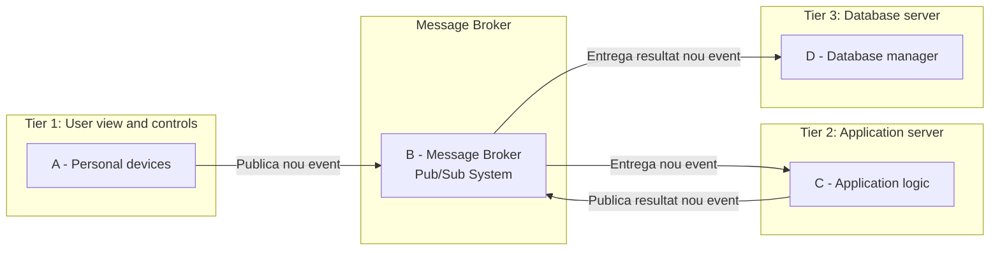
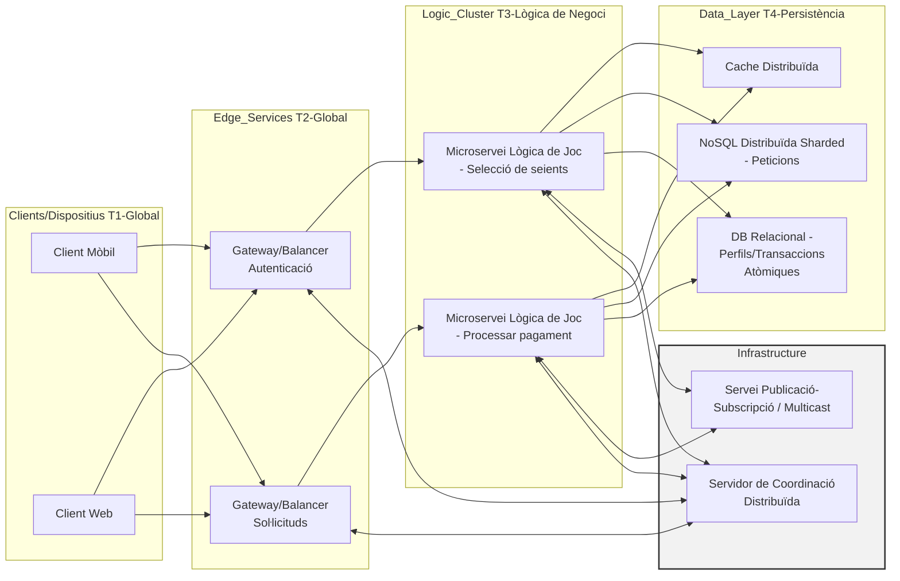
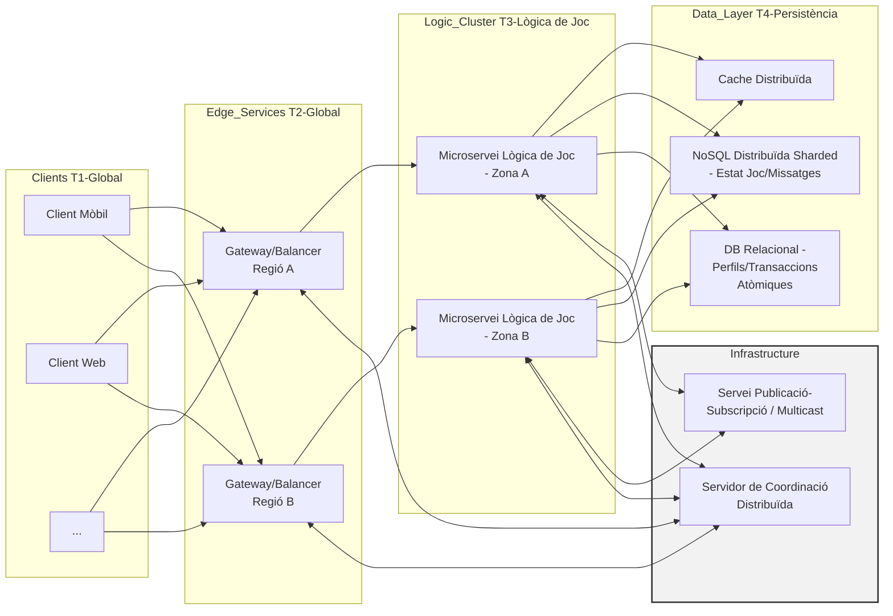

##### Abel Bolance Olivares Pàg 1
### Sistemes Distribuïts - PAC 1
#####
1. Relaciona cadascun dels escenaris amb un únic repte propi dels sistemes distribuïts i explica la problemàtica que planteja aquest repte a l'escenari escollit. Tingues en compte que, encara que un mateix escenari pugui associar-se a diversos reptes, hauràs de justificar únicament el que seleccionis i que cada repte només pot ser utilitzat una vegada a tot l'exercici. Els reptes disponibles són: heterogeneïtat, obertura, seguretat, escalabilitat, gestió de fallades, concurrència, transparència i qualitat del servei. Per exemple, l'escenari de Google File System (GFS) es pot associar al repte de transparència ja que els usuaris accedeixen als fitxers sense conèixer a quin servidor estan emmagatzemats. (https://research.google/pubs/the-google-file-system/) Escenaris:

a. L’eina Chaos Monkey (https://netflix.github.io/chaosmonkey/) b. L’especificació d’OpenAPI (https://swagger.io/specification/) c. Un sistema de reserva de vols d. Una banca electrònica e. Una base de dades distribuïda com és etcd (https://etcd.io/) f. L’eina Jaeger (https://www.jaegertracing.io/) g. L’eina Docker (https://www.docker.com/) h. Una xarxa wifi dintre d’un campus o unes oficines
##### a. L’eina Chaos Monkey (https://netflix.github.io/chaosmonkey/)
##### **Gestió de fallades**, “Chaos Monkey is responsible for randomly terminating instances in production to ensure that engineers implement their services to be resilient to instance failures.” En els sistemes distribuïts els seus elements poden fallar de forma independent, si un sistema no gestiona correctament les possibles fallades pot afectar a la caiguda del sistema i a la pèrdua de dades.

##### b. L’especificació d’OpenAPI (https://swagger.io/specification/)
##### **Obertura**, “The OpenAPI Specification (OAS) defines a standard, language-agnostic interface to HTTP APIs which allows both humans and computers to discover and understand the capabilities of the service without access to source code, documentation, or through network tra ic inspection. When properly defined, a consumer can understand and interact with the remote
##### Abel Bolance Olivares Pàg 2
##### service with a minimal amount of implementation logic.”. Es la capacitat d’afegir o reemplaçar components al sistema, això s’aconsegueix mitjançant la publicació de les interfícies del programari.

##### c. Un sistema de reserva de vols
##### **Concurrència**, en un sistema de reserves molts clients poden intentar accedir a la vegada a les mateixes dades. Si el sistema no està ben definit les dades poden ser inconsistents i permetre la reserva d’un mateix seient del mateix vol mes de una vegada.
##### d. Una banca electrònica
##### **Seguretat**, l’intercanvi d’informació sensible com poden ser els comptes bancaris es un repte de seguretat. S’ha de garantir la confidencialitat de les dades, la transferència d’informació ha de ser segura.

##### e. Una base de dades distribuïda com és etcd (https://etcd.io/)
##### **Escalabilitat**, “A distributed, reliable key-value store for the most critical data of a distributed system”. Es important el disseny de la base de dades per escalar a mesura que incrementen el clients i cada vagada s’ha de gestionar mes volum de dades.
##### f. L’eina Jaeger (https://www.jaegertracing.io/)
##### **Qualitat del Servei**, “Monitor and troubleshoot workflows in complex distributed Systems”. (Quality of Service – QoS) Capacitat de complir paràmetres de rendiment , seguretat i fiabilitat. Monitoritzar el sistema per determinar si satisfà els requisits de rendiment i latència.

##### g. L’eina Docker (https://www.docker.com/)
##### **Heterogeneïtat**, “Docker helps developers build, share, run, and verify applications anywhere — without tedious environment configuration or management.”. Els sistemes distribuïts es basen en un sistema heterogeni de xarxes, maquinari, sistemes operatius, ... Docker aborda la virtualització a nivell de sistemes operatius.
##### h. Una xarxa wifi dintre d’un campus o unes oficines
##### **Transparència**, en una xarxa sense fils els usuaris poden utilitzar dispositius portàtils. La transparència de mobilitat permet que el dispositiu de l’usuari canviï d’un punt d’accés a un altre sense que l’usuari experimenti pèrdua de connexió.

##### Abel Bolance Olivares Pàg 3
#####
2. La figura 2.8b (pàg. 70 del llibre de referència de l'assignatura) mostra un model de comunicació directa entre entitats a les diferents capes. Com canviaria aquesta arquitectura si la comunicació es basés en un sistema de publicació-subscripció? Redibuixa o replanteja el disseny a la teva resposta. Explica, a més, els principals avantatges i inconvenients que suposaria aquest canvi en el model de comunicació.
##### Figura 2.8b
##### La comunicació canviaria d’un sistema de comunicació directe a un sistema de comunicació indirecta. El disseny planteja un sistema de tres capes, els Clients (Tier 1) es comuniquen amb els Servidors de Aplicacions (Tier 2) i aquests amb el Servidor de Base de Dades (Tier 3). Si s’aplica un sistema de publicació-subscripció, s’introduiria un nou component intermediari de gestió de peticions. En el nou disseny totes les capes interactuen amb el sistema de publicació-subscripció, les relacions directes entre les diferents capes desapareixen. El sistema de publicació-subscripció actua com a gestor d’intercanvi de peticions. Els Clients (Tier 1) actuen com a publicadors de soŀlicituds i com subscriptors dels resultats de les peticions. El Servidors d’Aplicacions (Tier 2) actuen com subscriptors per rebre les peticions del Clients i com publicador dels resultats que rep del Servidor de Base de Dades. El Servidor de Base de Dades (Tier 3) actua com a subscriptor de les peticions del Servidors d’Aplicacions. La seqüència de les dades passaria d’una comunicació directa (síncrona) a una comunicació orientada a esdeveniments (asíncrona).

##### Abel Bolance Olivares Pàg 4
#####
#####
##### Avantatges:  Desacoblament espacial, el remitent no necessita conèixer la identitat
##### del receptor, això permet replicar o migrar components sense afectar al sistema.
#####  Desacoblament temporal, els remitents i receptors son independents ja que el gestor d’intercanvi de peticions pot emmagatzemar les peticions.
#####  Escalabilitat, el sistema de publicació-subscripció permet comunicacions 1 a molts, si mols Clients necessiten la mateixa informació es mol mes eficient amb aquest sistema que rebre múltiples peticions individuals idèntiques.

#####  Gestió de fallades, els components individuals poden fallar sense que afecti a la resta de components.
#####
#####
##### Abel Bolance Olivares Pàg 5
##### Inconvenients:  Rendiment, el nou component de gestió d’intercanvi de peticions
##### comporta una sobrecàrrega de rendiment.  Pèrdua de la comunicació directe, es per la soŀlicitud-resposta en línia,
##### per permetre un entorn desconnectat.
#####
<!-- IMAGEN EXTRAÍDA: Image001 -->
### Figura Image001: Gràfic d'Arquitectura de Comunicació Indirecta (Publicació-Subscripció)

**Descripción Técnica Detallada:**
El diagrama (Graf exercici 2) il·lustra l'arquitectura de comunicació indirecta basada en el model Publicació/Subscripció (Pub/Sub) aplicada a un sistema de tres capes originalment directe (similar a la Figura 2.8b). Els components són: Tier 1 (A - Dispositius personals), un Message Broker (B - Sistema Pub/Sub), Tier 2 (C - Lògica de l'Aplicació), i Tier 3 (D - Gestor de Base de Dades). La comunicació es centralitza en el Message Broker (B), actuant A com a publicador d'esdeveniments cap a B. B lliura l'esdeveniment a C, C publica el resultat, i B lliura el resultat a D (Base de Dades). Aquest canvi facilita el desacoblament espacial i temporal, transformant la comunicació síncrona original en un flux asíncron orientat a esdeveniments.

##### Abel Bolance Olivares Pàg 6
3. Proposa un sistema distribuït real no inclòs al llibre. Explica els principals reptes tècnics associats amb la implementació d'un model d'arquitectura de N capes en un entorn de producció real. Fes un gràfic iŀlustratiu i detalla com les diferents capes interactuen entre si. Explica com es poden superar els reptes relacionats amb escalabilitat, heterogeneïtat i gestió de fallades en aquest sistema.

##### Sistema de venda de entrades online. Sistema per gestionar la venda de entrades fixes a un espectacle a milions d’usuaris que accedeixen de manera simultània. Requereix un sistema distribuït capaç de gestionar pics de carrega extrema (venda d’entrades a concerts importants) i garantir lo consistència de les dades, evitar la venda d’un mateix seient a mes d’un usuari. Es proposa un model d’arquitectura de 4 capes.
| Capa (Tier Tn) | Nom | Funció |
| :--- | :--- | :--- |
| Tier 1 (T1) | Clients/Dispositius | Interfícies d’usuari |
| Tier 2 (T2) | API Getway | Equilibradors de càrrega, |

| Capa (Tier Tn) | Nom | Funció |
| :--- | :--- | :--- |
| | | Gestió de soŀlicituds, Autentificació |
| Tier 3 (T3) | Lògica de negoci | Lògica de la venda (selecció de seient, preus, processar pagaments,...) |
| Tier 4 (T4) | Persistència distribuïda | Bases de dades (Espectacles, Seients, perfils d’usuari, Transaccions, ...) |

##### Escalabilitat, en la publicació d’un espectacle important es produeixen milers de peticions simultànies que volen adquirir seients, si el sistema no escala en aquestes situacions es produeixen colls d’ampolla que saturen el sistema de venda. L’Arquitectura de N capes facilita l’escalabilitat individual de cada capa facilitant el procés. Es pot utilitzar un clúster de Servidor. Heterogeneïtat, la lògica de negoci pot utilitzar microserveis escrits en diferents llenguatges i la persistència pot utilitzar diferents base de dades. Aplicar una capa d’abstracció i utilitzar serveis web amb comunicació estàndard per evitar el problemes d’heterogeneïtat. La virtualització (amb eines com Docker) permet que la lògica de negoci s’executi en un entorn uniforme.

##### Abel Bolance Olivares Pàg 7
##### Gestió de fallades, el sistemes distribuïts poden patir fallades parcials, el sistema ha de ser capaç de detectar-les i recuperar-se. Mitjançant la redundància de components augmenta la disponibilitat del servei.
#####
#####
<!-- IMAGEN EXTRAÍDA: Image002 -->
### Figura Image002: Gràfic d'Arquitectura de 4 Capes per a un Sistema de Venda d'Entrades Online

**Descripción Técnica Detallada:**
El diagrama (Graf exercici 3) representa una arquitectura de 4 capes (N-capes) dissenyada per a la venda d'entrades en línia, amb alta càrrega. La Capa T1 (Clients/Dispositius) interactua amb la Capa T2 (Edge Services/Gateways), que gestiona l'autenticació i l'equilibri de càrrega. La Capa T3 (Logic Cluster) conté microserveis de Lògica de Negoci (LGA, LGB) dedicats a tasques crítiques com la selecció de seients i el processament de pagaments. Aquesta lògica es connecta amb la Capa T4 (Persistència), que inclou Cache Distribuïda, NoSQL Sharded (peticions) i DB Relacional (transaccions atòmiques). Es destaca l'ús d'Infrastructure Services (PSB, COORD) per a la comunicació asíncrona (Pub/Sub) i la coordinació entre capes.

##### Abel Bolance Olivares Pàg 8
#####
4. És possible implementar una memòria cau distribuïda entre la base de dades i l'aplicació? Explica com funciona i quins avantatges o problemes poden sorgir en un sistema distribuït. Reflexiona sobre si l'estil de comunicació entre els components podria afectar el seu disseny. Investiga si la tècnica coneguda com a Data Sharding podria millorar el rendiment i justifica la resposta.

##### Si que es possible i recomanable implementar una memòria cau entre la capa d’aplicació i la base de dades. Permet gestionar la necessitat d’escalabilitat i rendiment en grans sistemes distribuïts. En aquesta implementació la capa d’aplicació interactua constantment amb la base de dades. La memòria cau distribuïda s’implementaria com una capa de dades intermèdia a prop de la capa d’aplicació. La memòria cau distribuïda emmagatzema conjunts de dades recents i freqüents. Quan l’aplicació necessita obtenir una dada, primer comprova si està a la memòria cau, si la dada existeix es retorna ràpidament, si la dada no existeix es demana a la base de dades i s’actualitza a la memòria cau. Quan l’aplicació necessita emmagatzemar una dada, l’emmagatzema a la memòria cau i es redunda persistentment a la base de dades.
##### Els avantatges d’aquest sistema son ...
#####  El Rendiment, ja que l’accés als recursos en xarxa es molt mes lent que

##### l’accés a la memòria cau local.
#####  La reducció de la càrrega en la base de dades que evita colls d’ampolla
##### en l’accés a les dades.
##### Els principals problemes d’aquest sistema poden ser ...
#####  El manteniment de la consistència de les dades.
#####  La propagació de les dades quan es modifica la base de dades i totes
##### les memòries cau han de ser actualitzades.
#####  La complexitat del disseny per mantenir les dades actualitzades.
##### L’estil de comunicació entre l’aplicació, la memòria cau distribuïda i la base de dades afecta al disseny del protocol de consistència de les dades.

##### La tècnica Data Sharding milloraria el rendiment del sistema. El sharding consisteix en dividir el conjunt de dades en parts i gestionar cada part de manera independent. Permet millorar l’escalabilitat i reduir el colls d’ampolla.
##### Abel Bolance Olivares Pàg 9
#####
5. Tens un prototip de sistema de jocs en línia massius i de múltiples jugadors (MMOGs). Actualment la configuració és de 2 màquines virtuals amb una base de dades relacional en comú per emmagatzemar els missatges. Digues quins són els problemes si volem atendre milers de peticions per segon a escala mundial i identifica els colls d'ampolla. Utilitza els components que consideris necessaris i proposa un nou model que permeti més escalabilitat i rendiment. Fes un gràfic amb el nou model.

##### El disseny actual presenta problemes de rendiment, no està dissenyat per rebre milers de peticions, les peticions a escala mundial poden obtindré elevats temps de latència. Tolerància a fallades. dependre d’una única base de dades es un problema important si la base de dades cau o no respon. Escalabilitat, la infraestructura de servidors es molt limitada. El nou model es pot dissenyar amb una arquitectura de N capes per millorar el rendiment i la escalabilitat.
##### Components necessaris:
#####  Infraestructura física mitjançant una arquitectura de clúster amb

##### centenars de nodes distribuïts geogràficament per reduir la latència a nivell mundial.
#####  Comunicació indirecta mitjançant un sistema de Publicació-Subscripció per atendre les peticions i interaccions entre jugadors.
#####  Particionament del mon virtual (mons, nivells, ...) en diferents servidors per afavorir l’escalabilitat.
| Capa (Tier Tn) | Nom | Funció |
| :--- | :--- | :--- |
| Tier 1 (T1) | Clients/Dispositius | Jugadors que utilitzen web, mòbils,... |
| Tier 2 (T2) | API Getway | Equilibradors de càrrega, Gateways distribuïts geogràficament per reduir la latència |

| Capa (Tier Tn) | Nom | Funció |
| :--- | :--- | :--- |
| Tier 3 (T3) | Lògica del joc | Cluster de servidors amb particionament (mons, nivells,...) |
| Tier 4 (T4) | Persistència distribuïda | Conjunt de bases de dades particionades per a l’estat del joc i el xat de jugadors i memòria cau distribuïda per les dades freqüents. |

##### Abel Bolance Olivares Pàg 10
#####
<!-- IMAGEN EXTRAÍDA: Image003 -->
### Figura Image003: Nou Model d'Arquitectura Distribuïda N-Capes per a MMOGs

**Descripción Técnica Detallada:**
El diagrama (Graf exercici 5) presenta una arquitectura de 4 capes altament escalable i globalment distribuïda per a MMOGs. La Capa T2 (Edge Services) inclou Gateways/Balancers regionalment distribuïts (Regió A, Regió B) per minimitzar la latència. La Capa T3 (Logic Cluster) està particionada (Zona A, Zona B), reflectint el *sharding* del món virtual. La Capa T4 (Data Layer) utilitza Cache Distribuïda i Bases de Dades NoSQL/Relacionals particionades per a l'estat del joc i missatges. La comunicació i coordinació entre les capes Lògica i Gateway es recolza en serveis d'Infraestructura (Pub/Sub i Servidor de Coordinació Distribuïda) per gestionar les milers de peticions per segon de manera eficient.

##### Abel Bolance Olivares Pàg 11
Referències
Distributed Systems Concepts and Desing Fifth Edition
Generació de gràfics amb llenguatge markdown (MD) amb la funció “graph” i representació en un entorn Github per a la seva representació.

##### Abel Bolance Olivares Pàg 12
Graf exercici 3
*(El codi Mermaid per al Gràfic exercici 3 ja ha estat transferit i inclòs sota la Figura Image002 per a la seva localització lògica, seguint les instruccions d'optimització)*.

##### Abel Bolance Olivares Pàg 13
Graf exercici 5
*(El codi Mermaid per al Gràfic exercici 5 ja ha estat transferit i inclòs sota la Figura Image003 per a la seva localització lògica, seguint les instruccions d'optimització)*.