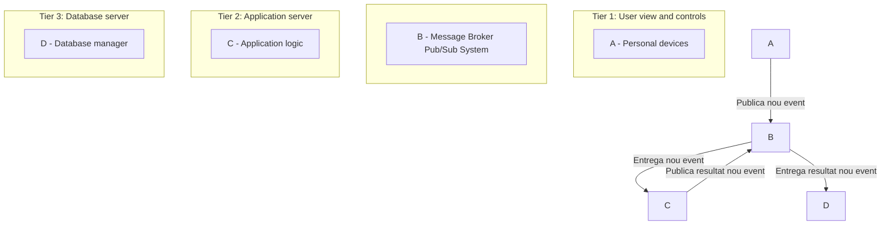

```mermaid
graph TD
subgraph Tier 1: User view and controls
A\[A - Personal devices]
end

subgraph " "
B\[B - Message Broker Pub/Sub System]
end

subgraph Tier 2: Application server
C\[C - Application logic]
end

subgraph Tier 3: Database server
D\[D - Database manager]
end

A -- Publica nou event --> B
B -- Entrega nou event --> C
C -- Publica resultat nou event --> B
B -- Entrega resultat nou event --> D
```

