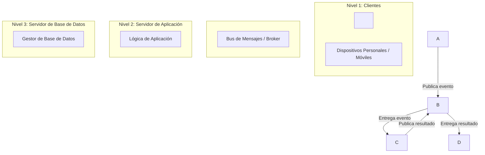

```mermaid

graph TD

&nbsp;   subgraph Nivel 1: Clientes

&nbsp;       A\[Dispositivos Personales / Móviles]

&nbsp;   end


&nbsp;   subgraph " "

&nbsp;       B\[Bus de Mensajes / Broker]

&nbsp;   end


&nbsp;   subgraph Nivel 2: Servidor de Aplicación

&nbsp;       C\[Lógica de Aplicación]

&nbsp;   end


&nbsp;   subgraph Nivel 3: Servidor de Base de Datos

&nbsp;       D\[Gestor de Base de Datos]

&nbsp;   end


&nbsp;   A -- Publica evento --> B

&nbsp;   B -- Entrega evento --> C

&nbsp;   C -- Publica resultado --> B

&nbsp;   B -- Entrega resultado --> D

```

