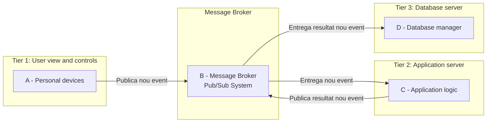

```mermaid
graph LR
    subgraph Tier 1: User view and controls
        A["A - Personal devices"]
    end

    subgraph "Message Broker"
        B["B - Message Broker<br>Pub/Sub System"]
    end

    subgraph Tier 2: Application server
        C["C - Application logic"]
    end

    subgraph Tier 3: Database server
        D["D - Database manager"]
    end

    A -- "Publica nou event" --> B
    B -- "Entrega nou event" --> C
    C -- "Publica resultat nou event" --> B
    B -- "Entrega resultat nou event" --> D
```

