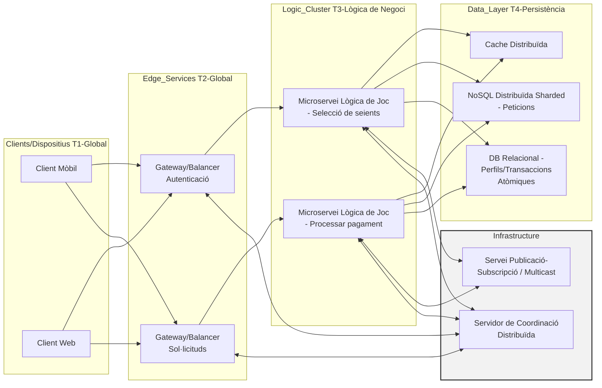

```mermaid
graph LR
    subgraph Clients/Dispositius T1-Global
        C1["Client Mòbil"]
        C2["Client Web"]
    end

    subgraph Edge_Services T2-Global
        G1["Gateway/Balancer<br>Autenticació"]
        G2["Gateway/Balancer<br>Sol·licituds"]
    end

    subgraph Logic_Cluster T3-Lògica de Negoci
        LGA["Microservei Lògica de Joc<br>- Selecció de seients"]
        LGB["Microservei Lògica de Joc<br>- Processar pagament"]
    end
    
    subgraph Infrastructure
        style Infrastructure fill:#f2f2f2,stroke:#333,stroke-width:2px
        PSB["Servei Publicació-<br>Subscripció / Multicast"]
        COORD["Servidor de Coordinació<br>Distribuïda"]
    end

    subgraph Data_Layer T4-Persistència
        DCACHE["Cache Distribuïda"]
        DDB["NoSQL Distribuïda Sharded<br>- Peticions"]
        RDB["DB Relacional -<br>Perfils/Transaccions<br>Atòmiques"]
    end

    %% --- Conexiones del Flujo Principal ---
    C1 & C2 --> G1
    C1 & C2 --> G2
    
    G1 --> LGA
    G2 --> LGB
    
    LGA --> DCACHE & DDB & RDB
    LGB --> DCACHE & DDB & RDB

    %% --- Conexiones con la Infraestructura ---
    LGA <--> PSB
    LGB <--> PSB
    
    G1 & G2 <--> COORD
    LGA & LGB <--> COORD

```
