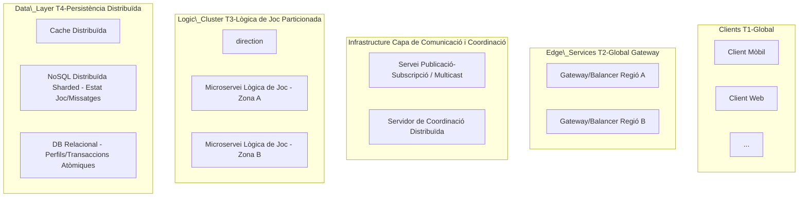

```mermaid
graph TD
subgraph Clients T1-Global
C1\[Client Mòbil]
C2\[Client Web]
C3\[...]
end

subgraph Edge\_Services T2-Global Gateway
G1\[Gateway/Balancer Regió A]
G2\[Gateway/Balancer Regió B]
end

subgraph Infrastructure Capa de Comunicació i Coordinació
PSB\[Servei Publicació-Subscripció / Multicast]
COORD\[Servidor de Coordinació Distribuïda]
end

subgraph Logic\_Cluster T3-Lògica de Joc Particionada
LR\[direction]
LGA\[Microservei Lògica de Joc - Zona A]
LGB\[Microservei Lògica de Joc - Zona B]
end

subgraph Data\_Layer T4-Persistència Distribuïda
DCACHE\[Cache Distribuïda]
DDB\[NoSQL Distribuïda Sharded - Estat Joc/Missatges]
RDB\[DB Relacional - Perfils/Transaccions Atòmiques]
end
```

